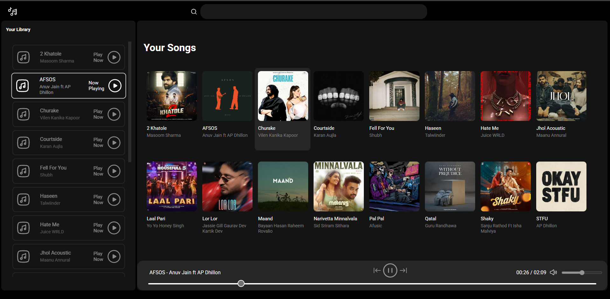

# 🎵 Melodrift – A Sleek Web-Based Music Player

Melodrift is a clean and modern browser-based music player built using **HTML**, **CSS**, and **JavaScript**. Designed for simplicity and speed, it automatically reads music files from a local folder and displays them with a stylish, responsive UI — no frameworks or external libraries required.

---

## 🚀 Features

- Play, pause, and seek controls  
- Real-time music loading from the `/songs` folder  
- Auto-matching song thumbnails  
- Custom progress and volume sliders   
- Built with vanilla JavaScript — no dependencies

---

## 📂 Usage Instructions

### 🎵 Adding Songs

1. Place your `.mp3` files inside the `/songs` folder.
2. Use the following naming format for each file:  Song Name - Artist Name.mp3

### 🖼️ Adding Thumbnails

1. Save your thumbnail images inside the `/assets/thumbnail` folder.
2. Recommended format:
- **Resolution:** `300px x 300px`
- **File Type:** `.jpg`
3. Save the image with the **exact song name** used in the `.mp3` file:  
Example:
  Song file: Shape of You - Ed Sheeran.mp3
  Thumbnail: Shape of You.jpg

Melodrift will automatically match the song and its thumbnail based on the song title.

---

## 📸 Preview

---

## 📄 License

This project is open-source and available under the [MIT License](LICENSE).

---

Enjoy the drift 🎶

